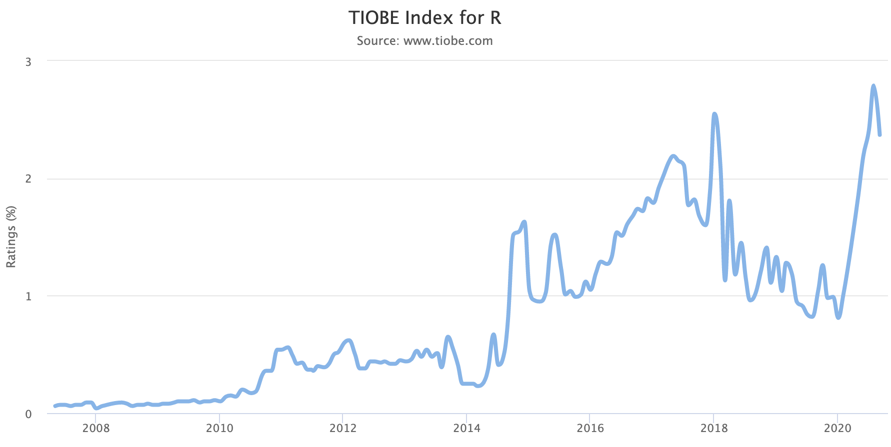

---
output:
  pdf_document: default
  html_document: default
urlcolor: blue
---
 
# General Information

## Prerequisites  
-   Basics in file management and familiarity with data sheets (in Microsoft Excel, Google sheets, etc.)
  
## Learning objective  

------------

>     
> * Be able to navigate R Studio and write reproducible code.    
> * Execute lines of code, as well as complete scripts.      
> * Identify variables, functions, and operators.     
> * Approach basic troubleshooting.     
> * Know how to download biodiversity data using Application Programming Interfacen (API).  
>

------------


## Introduction {#intro}
Students will learn R basics while downloading biodiversity data from multiple data repositories. This module will walk students through installing R, navigating R,writing reproducible scripts in R, and using R to download biodiversity data.

```{r echo=FALSE, fig.align = 'center'}

```

## Why R?

{width="458"}

-   R is a popular scripting language with readily available jobs (see jobs here: [r-users.com](https://www.r-users.com/))

-   R allows for reproducibility

    -   Every step is documented by each line of code in an analysis.

-   R is free and open access

    -   there is no associated cost 💲
    -   lots of community support for writing and troubleshooting code (ex. [Overflow](https://stackoverflow.com/))

-   R is interdisciplinary

-   R can create beautiful figures

## References

There are a lot of online resources for learning R.  Throughout this activity we reference additional resources that may be useful. Below, we summarize the cited resources, as well as some additional references. We used many of these resources to create this activity.

#### General {.unnumbered}

-   [R Ecology Lesson](https://datacarpentry.org/R-ecology-lesson/index.html)

    -   Introduction chapters for data carpentry ecology. 

-   [RStudio Education](https://education.rstudio.com/learn/beginner/)

    -   Resources for beginners by the creators of R Studio.

-   [R-bloggers](https://www.r-bloggers.com/)

    -   R news and tutorials by hundreds of R bloggers.

-   [R for cats](https://rforcats.net/) and cat lovers

    -   A cat🐱-oriented way to learn R basics.

-   [R for Biologist NIMBioS](http://www.nimbios.org/products/prod_pdfs/RforBiologistv1.1.pdf)

    -   An introduction to R and descriptive statistics 📊.

-   [RYouWithMe](https://rladiessydney.org/courses/ryouwithme/)

    -   Made by R-ladies Sydney. Fun tutorials on R basics, data cleaning, data visualization, and R markdowns.

-   [The Carpentries](https://carpentries.org/)

    -   "The Carpentries teaches foundational coding, and data science skills to researchers worldwide." This organization hosts workshops and makes its lesson plans available freely for self-learning and reuse. Main lessons are divided into..."

-   [R for Data Science](https://r4ds.had.co.nz/)

    -   "R for Data Science" textbook.

-   [Twitter for R programmers](https://www.t4rstats.com/)

    -   Learn how to connect with the R community over twitter.

#### Tidyverse {.unnumbered}

[Tidyverse](https://www.tidyverse.org/) is a must-have suite of packages (defined in section 3.3) for data wrangling and analysis that includes many packages. Important :

-   [dplyr](https://dplyr.tidyverse.org/)

    -   data manipulation and management

-   [tidyr](https://tidyr.tidyverse.org/)

    -   tidying your data

-   [ggplot2](https://ggplot2.tidyverse.org/)

    -   data visualization

#### R based courses {.unnumbered}

-   [DataScienceBox](https://datasciencebox.org/)

-   [STAT 545](https://stat545.com/)

-   [Data Carpentry for Biologist](https://datacarpentry.org/semester-biology/)
